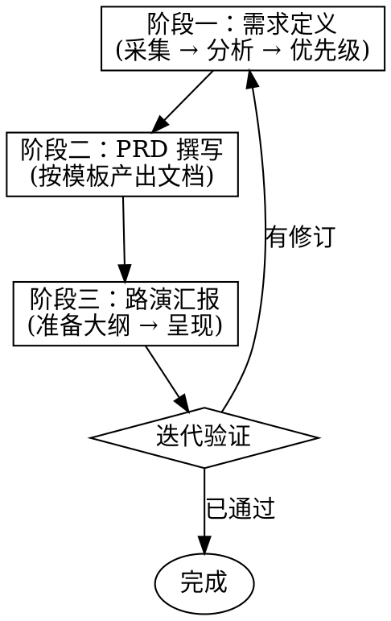

# Product Management

## 概述

此 skill 协助产品经理（或代为完成）产品工作全流程：需求定义 → PRD 撰写 → 路演汇报。覆盖互联网、AI、数据三个领域。

## 触发时机

你应当调用此 skill 的场景包括：

- 用户说「帮我写个 PRD」、「定义这个需求」、「分析一下用户需求」
- 用户需要确定产品需求的范围、目标和验收标准
- 用户需要准备面向团队或老板的产品路演
- 用户需要梳理产品思路、拆解需求、定义成功指标
- 用户需要针对 AI 产品、数据产品或互联网产品进行需求分析

如果你不确定，但用户提到了任何产品管理相关的工作——请加载此 skill 确认是否适用。

## 核心工作流

### 阶段一：需求定义

此阶段聚焦回答三个问题：做什么？为什么做？怎么算做成？

**步骤：**

1. **采集输入** — 与用户对话明确需求背景。收集用户反馈、数据分析结论、竞品信息、业务目标等。
2. **需求分析** — 如有必要，读取 `references/requirement-analysis.md` 中的分析方法，帮助系统化地拆解需求。
3. **定义核心** — 明确以下要素并与用户确认：
   - 要解决什么问题（问题定义）
   - 目标用户是谁
   - 成功指标是什么
   - 优先级与范围边界

**产出：** 一份与用户对齐的需求定义纪要，可直接进入 PRD 撰写。

### 阶段二：PRD 撰写

**步骤：**

1. **加载模板** — 读取 `references/prd-template.md`，了解 PRD 十大章节结构。
2. **判定领域** — 根据需求内容判断所属领域（互联网 / AI / 数据），在撰写时参考各节中的领域标签。
3. **逐节撰写** — 按模板章节顺序，逐节输出内容。每写完 2-3 节可询问用户是否需要调整。
4. **完整 PRD** — 输出完整 markdown PRD 文档。

**产出：** 一份完整的 PRD markdown 文档。

### 阶段三：路演汇报

**步骤：**

1. **加载模板** — 读取 `references/roadshow-template.md`，了解路演大纲结构。
2. **填充内容** — 将 PRD 内容提炼为路演要点，按大纲组织。
3. **呈现** — 以 markdown 大纲形式输出路演文稿，供用户直接使用或转制 PPT。

**产出：** 一份路演大纲文档。

### 迭代验证

路演后可能产生修订意见，回到阶段一或二进行迭代。

## 领域指引

不同产品领域在撰写 PRD 时需关注的重点不同：

### 互联网产品
- 关注用户体验路径、交互流程、页面流转
- 指标侧重：DAU/MAU、转化率、留存、NPS
- 技术侧关注前后端架构、性能、可用性

### AI 产品
- 关注模型能力边界、人机交互模式、Prompt 设计
- 指标侧重：模型准确率、幻觉率、推理成本、用户满意度
- 技术侧关注模型选型、RAG 架构、Agent 编排、推理成本
- 特别注意：AI 产品的不确定性管理（模型输出不可控时的兜底策略）

### 数据产品
- 关注数据口径、数据链路、数据质量
- 指标侧重：数据准确率、覆盖度、时效性、查询性能
- 技术侧关注数据源接入、ETL 流程、可视化方案、权限管理
- 特别注意：数据产品的用户可能是不同角色（分析师、业务方、管理层），需明确服务对象

## 参考文件索引

| 文件 | 内容 | 何时使用 |
|------|------|----------|
| `references/prd-template.md` | PRD 十大章节模板，含领域标签 | 进入「阶段二：PRD 撰写」时读取 |
| `references/roadshow-template.md` | 路演六节大纲 | 进入「阶段三：路演汇报」时读取 |
| `references/requirement-analysis.md` | 需求采集与分析方法 | 进入「阶段一：需求定义」时，如需深入分析则读取 |

## 输出格式

- PRD：完整 markdown 文档（.md）
- 路演大纲：markdown 大纲（可直接转制 PPT）
- 所有输出均保留文本格式，不依赖特定平台
